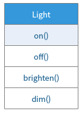

# 面向对象设计方式
1. 万物皆对象
2. 程序是对象的集合，它们通过发送信息来告知彼此所要做的事
3. 每个对象都有自己的由其他对象所构成的存储
4. 每个对象都拥有其类型
5. 某一特定类型的所有对象都可以接收同样的信息

# UML图
1. Unified Modelling Language，统一建模语言
2. 每个类都用一个方框表示，类名在方框的顶部，任何数据成员都在方框的中间部分。 

# 伴随多台的可互换对象
1. 在Java中，动态绑定是默认行为，不需要添加额外的关键字来实现多态
2. 把子类看做是积累的过程称为上转型(upcasting)